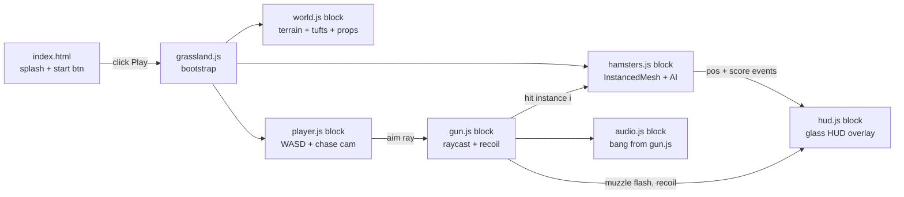

# Hammas → Hamster Grassland (Three.js voxel shooter)

## Context

Hammas v1.0 today is a Babylon.js hamster-cage simulator with a Gun Mod bolted on (`docs/js/gun.js` ≈ 1300 lines on top of an untouched 1.84 MB `ham.min.js`). The user wants to **replace the cage simulator entirely** with a Three.js, voxel-art, "relatively open-world" grassland: many NPC hamsters wander a plain, the player controls a voxel hamster avatar with a third-person follow camera, and sweeps fire across the field.

The existing Babylon scene, `ham.min.js`, `libs.js`, `pep.min.js`, `gun.js`, the cage starter-home picker, and the cage-specific assets (`accessories*.json`, `shaders/ham/*`) are all out of scope after this change. We **reuse** the `bang()` Web Audio gun synth, the glassmorphism + tactical-HUD design tokens, the SVG crosshair, the hit-bubble onomatopoeia bank, and the splash/branding from `index.html` — that visual language is the part of "現在網頁的概念" worth carrying forward.

## Approach

Rebuild `docs/index.html` around a single ES module entry, `docs/js/grassland.js`, that owns the whole game. Three.js is vendored to `docs/js/three/` so no CDN dependency. Voxel look comes from blocky `BoxGeometry`-based meshes plus a low-poly tinted ground plane; mass hamsters are drawn through one `InstancedMesh` per body part with `setMatrixAt` updates per frame.

### Module / data-flow shape

The "blocks" are sections inside one file — keeping it a single `grassland.js` mirrors `gun.js`'s style and avoids module-resolution overhead. Promote to separate files only if the file crosses ~1500 lines.

### Player avatar + camera

- Player is a small voxel hamster (`Group` of 6–8 `BoxGeometry` cubes: body, belly, head, ears×2, paws, tail). Rendered with `MeshLambertMaterial` for cheap shading; no shadows on the avatar.
- WASD moves the avatar in world-XZ; movement direction = camera-relative. Q/E rotates camera yaw 90° in 0.18 s tween. Mouse moves a screen-space crosshair.
- Camera is a `PerspectiveCamera` chase rig: anchored to player position with offset `(0, 14, 10)` and pitch ≈ 60° down — high enough to read the field as 上帝視角 while keeping the player hamster visible in the lower third. Smoothing via lerp `0.12`.
- Aim is a raycast from camera through the cursor, intersected with an invisible ground plane (`THREE.Plane(0,1,0,0)`); the avatar's `lookAt` rotates to the hit point so the gun barrel and crosshair always agree.

### Hamster NPCs

- One **shared voxel template** built once, then split into `InstancedMesh`es per body part (one for body+belly merged, one for head, one for ears merged) so the whole herd is ~3 draw calls.
- Per-instance state in `Float32Array`s: `pos[3*i]`, `vel[3*i]`, `state[i]` (0 idle / 1 wander / 2 flee / 3 dead), `hp[i]`, `colorTint[i]` (golden / grey / albino / chocolate).
- AI tick (every frame, all instances; cheap because no per-instance object): wander = random walk biased toward grass-tuft positions; on shot fired within `r=8`, transition to flee away from player for 2.5 s; on hp ≤ 0, mark dead, slump (rotate 90° on Z), schedule fade-out + removal in 1.4 s.
- After AI tick, write each live instance's matrix once via `setMatrixAt` and set `instanceMatrix.needsUpdate = true`. Per-instance tint via `instanceColor`.
- Spawn count: `~150` at start over a 200×200 unit plain. Respawn one every `~1.5 s` so the field never empties.

### World

- Ground = single `PlaneGeometry(200, 200, 64, 64)` with vertex colors (per-quad noise of 4 green hues) for a pixel-art tile feel. `MeshLambertMaterial({ vertexColors: true })`.
- Decoration via `InstancedMesh` (one each):
  - Grass tufts (small green column, 2000 instances scattered on Poisson-ish points)
  - Trees (3-cube voxel tree: brown trunk + green canopy, 30 instances)
  - Rocks (single grey cube, 50 instances)
  - Flowers (tiny pink/yellow cubes, 200 instances)
- `THREE.Fog` on far edges so the bounded world feels open. Sky = `scene.background = Color(0x9ed8ff)` plus a low-saturation directional light + soft ambient.

### Gun / sweep-fire

- Reuse the timing pattern from `gun.js`: 90 ms throttle on hold-fire (`~11 rounds/s`).
- On fire: raycast from camera through cursor against the hamster `InstancedMesh`es. `intersection.instanceId` identifies the hit hamster. Decrement `hp[i]`; one shot kills (single-hit feel matches the cage gun mod).
- Visual feedback (all reused from `gun.js`):
  - Crosshair recoil pulse (`#gunCrosshair.fire` class, 0.14 s)
  - Muzzle flash full-viewport radial gradient (0.12 s)
  - Hit bubble at projected screen point (OUCH / EEK / SQUEAK / BONK / OOF) — copy the bubble HTML + CSS verbatim
  - Yellow expanding hit ring at the projected impact point
  - Edge red vignette on hit
- Audio: copy `bang()` body from `docs/js/gun.js:1322-1352` into `grassland.js` unchanged.

### HUD

- Bottom-left glass card with `SHOTS` / `BONKED` columns — same markup/CSS as `gun.js` HUD, with the `#gunOverlay`'s `armed` state always on (you're always armed in grassland mode).
- Crosshair SVG copied from `gun.js`'s `injectUI` output.
- Top-left small pill: `← BACK` (returns to splash; only visible on Esc or hover near top-left). No tab/title/icon changes — splash already says **Hammas**.

## Files

### Replaced

- **`docs/index.html`** — strip the entire `
` Babylon canvas, the start-screen cage picker (`#starterHomes`, `#myHomes`), the cage-specific `<style>` blocks (lines 159–384), the ``.

### Added

- **`docs/js/three/three.module.js`** — vendored Three.js r163 (or current LTS). Implementer fetches via `curl -L https://unpkg.com/three@0.163.0/build/three.module.js -o docs/js/three/three.module.js`. No build step; the file is the single ESM bundle.
- **`docs/js/grassland.js`** — single ES module, the whole game (~800–1200 lines). Top-level structure:
  1. Imports from `'three'`.
  2. Constants block (world size, hamster count, fire rate, KICK constants — same names as `gun.js` so the design language stays coherent).
  3. `init()` — renderer, scene, camera, lights, fog, ground, props, hamster instanced meshes, player avatar, HUD inject (port of `injectUI()` from `gun.js`, trimmed to the elements the grassland uses), input listeners.
  4. Per-frame `tick(dt)` — input → player → camera follow → hamster AI → fire check → render.
  5. `bang()` — copied verbatim from `gun.js:1322-1352`.
  6. Hit-bubble / hit-ring / muzzle / vignette helpers — copied from `gun.js`.

### Deleted

- `docs/js/babylon.js`, `docs/js/ham.min.js`, `docs/js/libs.js`, `docs/js/pep.min.js`, `docs/js/gun.js` — no longer loaded; remove to keep the served bundle small.
- `docs/data/accessories.json`, `docs/data/accessories2.json`, `docs/data/shaders/` — cage-only assets.
- `docs/images/starter1..4.png` — cage-only thumbnails.
- `pretty/`, `analysis/` — reference material for the cage; keep on disk if the user wants archive, otherwise delete in a follow-up. Default: **keep** — they don't ship to the browser.

### Untouched

- `docs/manifest.webmanifest`, `docs/sw.js`, `docs/robots.txt`, `docs/favicon.svg`, `docs/favicon.ico`, `docs/css/styles.min.css` (no longer referenced after the index strip; safe to leave or delete in a later pass), fonts, `LICENSE`, `README.*` (will need a follow-up rewrite, but out of scope for this plan).

## Reused from existing code

| New thing | Source |
|-----------|--------|
| Web Audio gunshot synth | `docs/js/gun.js:1322-1352` (`bang()`) — copy verbatim |
| Glass HUD design tokens (`--gun-bg`, `--gun-accent`, etc.) | `docs/js/gun.js:48-64` |
| Crosshair SVG + recoil keyframe | `docs/js/gun.js:104-144` |
| Hit-bubble CSS + onomatopoeia list | `docs/js/gun.js:314-342` and the OUCH/EEK/SQUEAK/BONK/OOF bank |
| Hit-ring + muzzle-flash + vignette CSS | `docs/js/gun.js:278-311, 344-` |
| Splash gradient + Hammas title | `docs/index.html:57-106` |

## Verification

1. **Vendor Three.js**: `mkdir -p docs/js/three && curl -L https://unpkg.com/three@0.163.0/build/three.module.js -o docs/js/three/three.module.js`. Confirm file is ~1.2 MB ES module.
2. **Serve**: `cd docs && python -m http.server 8080`, open `http://localhost:8080/`.
3. **Splash → game**: splash shows `Hammas`, click **PLAY**, splash fades, grassland fades in within 1 s. No console errors.
4. **Movement**: WASD moves the player hamster; camera follows from high-rear; Q/E rotates camera 90°.
5. **Aim + fire**: cursor crosshair tracks the mouse; left-click plays `bang()` and triggers crosshair recoil + muzzle flash.
6. **Hit detection**: shoot a hamster — it slumps, fades out within ~1.4 s, score (`BONKED`) increments by 1, hit bubble pops at the impact point, edge vignette flashes.
7. **Hold-fire sweep**: holding LMB fires at ~11 rounds/s; sweeping the mouse across a cluster bonks several hamsters.
8. **AI**: shooting causes nearby hamsters to flee for ~2.5 s, then resume wandering.
9. **Perf**: with 150 hamsters and props instanced, frame time stays ≤ 8 ms on a recent laptop (DevTools Performance panel). Draw calls ≤ 20 (renderer.info.render.calls).
10. **No regressions from removal**: no 404s in Network tab; `docs/js/babylon.js` etc. should be gone, not 404ing.
11. **Mobile note**: not a target for v1 — touch controls are explicitly out of scope; document this in a one-line comment near the input handler.